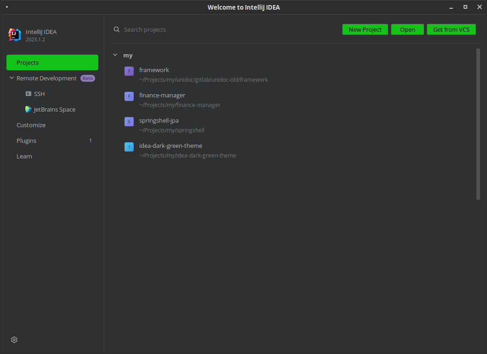
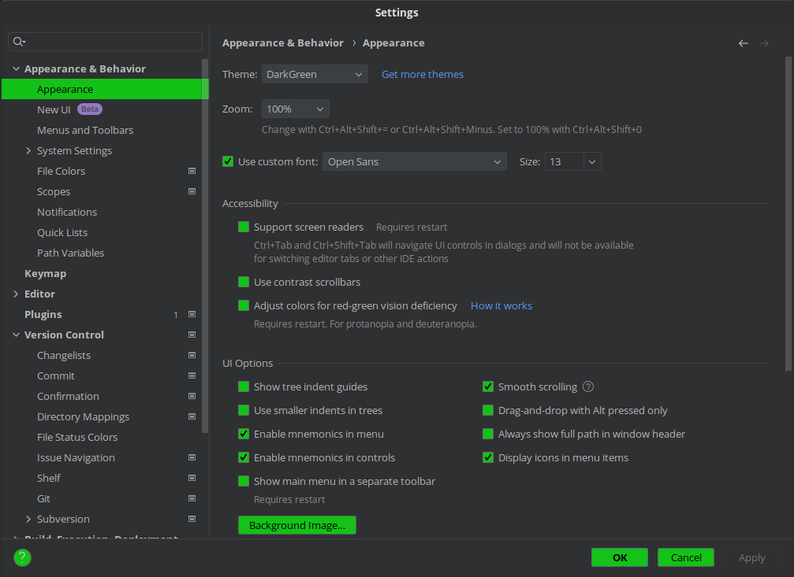
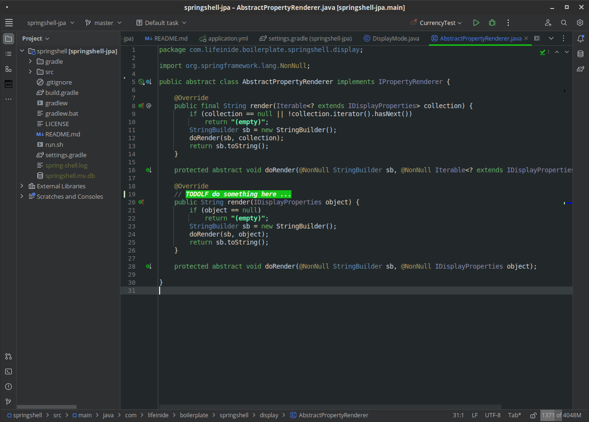

# Idea Dark Green Theme

A dark-green theme for Intellij Idea I use, based on [Darcula Darker Theme](https://plugins.jetbrains.com/plugin/12692-darcula-darker-theme) plus modified [Son of Obsidian](https://studiostyl.es/schemes/son-of-obsidian) code color scheme. Here's how it looks:







## How to use

Just package everything under `resources` directory to jar and import as an Idea theme plugin:

```bash
$ cd resources
$ jar cf IdeaDarkGreenTheme.jar META-INF theme
```

## Related GTK theme

Additional [gtk](./gtk) dir contains corresponding GTK theme based on [Materia Dark Compact](https://github.com/nana-4/materia-theme), which looks beautifully with [Breeze Dark Green](https://www.gnome-look.org/p/1328162) icons.

## Docs

1. [Theme example](https://github.com/JetBrains/intellij-community/blob/idea/231.9011.34/platform/platform-resources/src/themes/HighContrast.theme.json)
